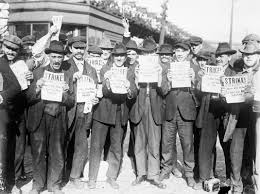
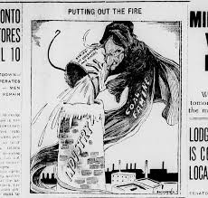
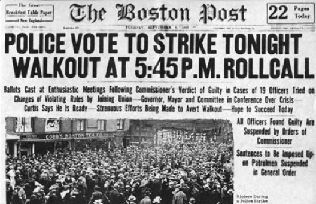

# The Red Scare

## Key Factors

### 1. **Russian Revolution (1917)**
   * The Bolshevik Revolution in Russia led to the establishment of a communist government under Lenin.
   * The success of communism in Russia raised concerns about the spread of radical left-wing ideas to other countries, especially in capitalist nations like the U.S.

### 2. **Labor Strikes**
   * The post war economic instability led to a series of labor strikes in 1919, particularly in steel, coal, and other industries.
   * These strikes were often seen by authorities as a sign communism

### 3. **The Rise of Anarchist Attacks**
   * Anarchists carried out bombings in 1919, targeting powerful officials, including Attorney General A. Mitchell Palmer.
   * These acts of violence intensified fears of an organized radical movement in the U.S.

## Key strikes during the Red Scare

### 1. **The steel workers strike**
   *  In September 1919, Steel workers went on strike demanding better working conditions and pay.
   * Over 350,000 workers went on strike and this caused a disruption in the steel industry
   * The strikes ended when the workers gave in and going back to their jobs

   

### 2. **The coal miners strike(1919)**
   * The term "Red Scare" refers to the widespread fear that communism and anarchism would take hold in the U.S. following the Russian Revolution.
   * Social unrest, including the strikes and the bombings, fed public anxiety about radical ideologies.

### 3. **The Boston Police Strike (1919)**
   * In September 1919, Boston police officers went on strike demanding better working conditions and pay.
   * The strike turned into a significant political issue, with accusations that it was part of the communist agenda
   * The strikes was a failure to the striking aofficers and a win to the new officers who got a high wage

