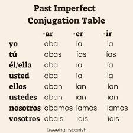
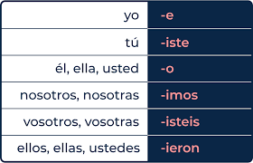

#  ¿Cuándo se usa el imperfecto?

1. Habitual or repeated action in the past 
1. Descriptions such as background information

***time weather age, date , emotions m physical appearance***

 3. If you have 2 actions going on simultaneously and did not interupt each other put both verbs in the impoerct
  
 ***Yo leía cuándo ella miraba el tele***

 # ¿Cuándo se usa el preterito?

 1. actions that happened once an were completed in the past
 1. used to relate a series of events that happened
 1. If one action is in progress and in interrupeted by an the action: put the action in progress in imperfect and the action interupting in preterito

 ***Yo leía cuando ella llegó***

