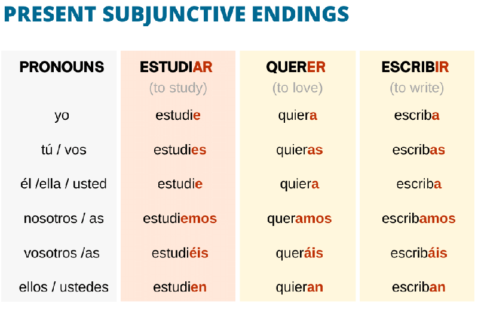

# Subjuntive Verbs

|Ar verbs | Er y Ir Verbs |
| :--:| :---: |
e, es, e, emos, en | a, as, a, amos, an 

| | Regular Verbs  | |  |
|:--: |:--:| :--:| :--:| 
| cantar | canto | cante, cantes, cante, cante, etc... |
|leer | leo | lea, leas, lea, etc...|
|vivir | vivo | viva, vivas, viva, etc...|

| | |Verbs with irregular YO form | |
|:--: |:--:| :--:| :--:| 
|tener | tengo | tenga, tengas, tenga, tengamos, etc..
|conocer | conozco | conozca, conozcas, conozca, conozcamso ects...

