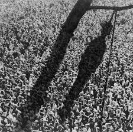
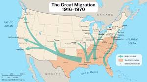
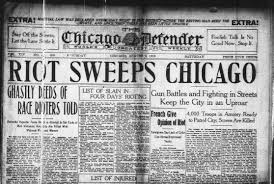

# The Great Migration

The **Great Migration** refers to the movement of African Americans from the rural South to urban areas in the North and West between **1916 and 1970**.

## 1. Problems in the South
* Black codes were laws designed to limit the freedom of black people after slavery
* Many states forced black people to sign labor contracts if you were to rufuse it would lead to being arrested or forced into unpaid labor
* Black people had to pay fees if they were worked a high-class job
* Many states also had it that if a black could not prove their employment by the start of the year to they be arrested
* Jim crow laws were used for racial segregation and to discriminate
* Lynching was a practice mostly used by the KKK against black people
* 4,742 lynchings happened with 3,445 of them being black people between 1882-1968

## 2. Opportunities in the North
* During the great migration, many African Americans left the south to find better opportunities in the north
* They were higher wages in the North, better education, and personal freedom
* Most moved to New York, Pittsburg, Chicago, and Detroit to try and live better lives
* The North was filled with progressive movements

## 3. Continued Prejudice in the North
* The red summer of 1919 is also known as the Chicago Race Riot of 1919
* Before the riots tensions were rising as many of the all white neighborhoods were now home to black communities
* Chicago’s African-American population had increased from 44,000 in 1909 to 100,000 to 1919
* Eugene William a 17 year old was killed when he was hit by a rock and drowned while he was crossing an imaginary barrier separating “black” and “white” beaches
* These riots killed 15 white people and 23 black people along with 500+ people being killed
* 1,000 black families had their houses burned down due to the riots
* hese riots caused people to work in officially segregated zones they had housing and many work industries

